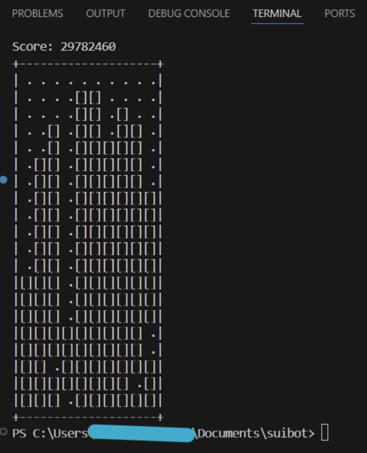

# Genetic Algorithm Tetris AI

This is a headless Tetris engine with an AI player that uses a genetic algorithm to tune its heuristic weights. It’s mainly a personal project for learning more about game AI and genetic algorithms. It is complete for the time being. 

## Project Features

- Headless Tetris Engine  
  A non-graphical modern Guideline Tetris simulator enables faster training and testing. 

- Heuristic-Based AI  
  The AI decides where to place pieces using board features like height, bumpiness, holes, wells, and lines cleared. Each feature has a weight that affects how good a move looks. 

- Genetic Algorithm  
  A genetic algorithm is used to automatically adjust heuristic weights based on how well the various AI agents perform. 

- BFS Piece Placement
  BFS implemented for pathfinding all possible piece positions, including slides, tucks, and spins. AI will return the best move by choosing an x-position, y-position, and rotation. 

## Demonstration

## Future Plans

- Average of 3 for each player?
- Multiprocessing implementation?
- More heuristics for encouraging setting up T-spins and such?

## Brains

The various brains are my models based on different training/feature additions. 
- Brain V1 was trained with very basic Tetris, where the only inputs where the current piece, the board and the four basic heuristics
- Brain V2 has an added height penalty on the AI
- Brain V3 was trained with an updated Tetris engine where it is now able to hold a piece and preview up to three pieces (only processes the current piece and the held piece because my laptop isn't powerful enough to do very deep look-aheads)
- Brain V4 was worse than Brain V3; I tried implementing a piecewise function that rewarded lower heights up to 5 and disliked upper heights exponentially (wasn't great)
- Brain V5 has a new wells heuristic and reverted back to the old height penalty but now doesn't penalize lower heights (<= 5)
- Brain V6 was trained overnight with a cap on how many moves each player had (took about 7.5 hours), performs worse than previous models (seemingly because it liked having more than 1 well)
- BrainV7 was after changing the well heuristic to only count one well instead of returning all the wells and allowing the AI to decide what to do with them
- BrainV8 was after reverting back to no shifting move cap
- BrainV9 was trained after changing the well heuristic to penalize more than one well
- BrainV10 (current best_brain) was trained after transitioning the engine from NES Tetris to Guideline Tetris

## Getting Started

**Requirements:** Python 3.x
**Recommended:** PyPy (helpful for speeding up the AI and programs)

Run `main.py` to see the current AI play in the headless engine. 
Run `trainer.py` if you wish to train your own genetic AI player (will override best_brain.json if it's better). 

## Notes

Inspiration for this project was from a certain Japanese VTuber...

## Contact

Maintainer: @Avotosui  
Email: avotosui@gmail.com